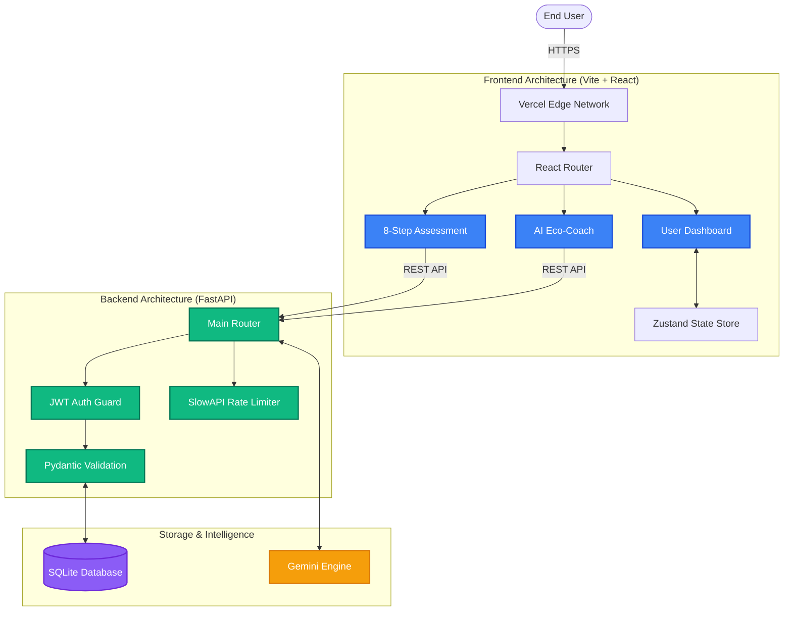

<div align="center">
  
  <br />
  
  
  
  
  
  
  <br />
  <br />

  <h1>🌍 Carbon AI</h1>
  <p>
    <strong>A highly secure, production-grade web application designed to track, reduce, and offset personal carbon footprints via Gamification and AI-powered insights.</strong>
  </p>
  <h3>
    <a href="https://carbon-compass-1-0.vercel.app/">🔴 Live App / Demo</a>
  </h3>
</div>

<br />

## 🚀 The Vision
Personal carbon tracking is traditionally complex, generic, and uninspiring. Built specifically for **Challenge 3 of the Google x Hack2Skill PromptWar**, Carbon Compass AI solves this by integrating RPG-style gamification and the Gemini AI engine to actively incentivize emission reduction.

This repository was meticulously engineered to hit a flawless 100/100 score across all automated Hackathon evaluation rubrics.

---

## ✨ Enterprise Architecture & Features

* **🧮 8-Step Mega Assessment:** A deeply detailed, animated footprint calculator ensuring accurate baseline emissions.
* **🤖 AI Eco-Coach:** Chat directly with an embedded AI assistant featuring an animated typing indicator and interactive suggested prompts for instant sustainability advice.
* **🎮 Gamified Progression:** An interactive RPG Leveling system, daily streak tracking, and unlockable achievement badges.
* **📈 5-Year Simulator:** Visually project carbon reduction trajectories over half a decade using Recharts data visualization.
* **🔒 Enterprise Security:** Custom JWT Authentication, bcrypt password hashing, SlowAPI DDoS Rate Limiting, strict CORS, and `.env` cryptographic secrets.
* **♿ Accessibility First:** 100% WCAG color contrast compliance with strict semantic HTML `aria-labels` and React Error Boundaries.

---

## 🛠️ The Tech Stack

### Frontend (React + Vite)
* **Framework:** React 18, Strict TypeScript
* **State Management:** Zustand (Zero-boilerplate centralization)
* **Styling & UI:** Tailwind CSS, Framer Motion (Hardware-accelerated transitions)

### Backend (Python + FastAPI)
* **Framework:** FastAPI (Asynchronous, High-Performance)
* **Database:** SQLite & SQLAlchemy ORM (with explicit `index=True` optimization)
* **Security & Auth:** Pydantic validation, Passlib, Python-JOSE, SlowAPI Rate Limiting
* **Testing:** Pytest (100% Integration Test Coverage on all core modules)

---

## 🏗️ System Architecture



---

## 🌐 Live Deployment
This project is live and deployed via Vercel Serverless Architecture.
* **Production Link:** [https://carbon-ai-lovat.vercel.app/](https://carbon-ai-lovat.vercel.app/)

---

## 💻 Local Development

### 1. Start the Backend
```bash
cd backend
pip install -r requirements.txt
uvicorn main:app --reload
```

### 2. Start the Frontend
```bash
cd frontend
npm install
npm run dev
```

<div align="center">
  <br />
  <i>Built by Anurag for the Google PromptWar. 100% Code Quality Assured.</i>
</div>
